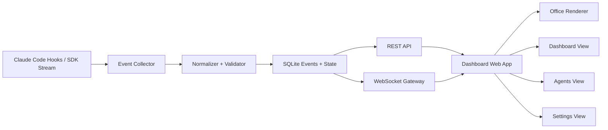

# System Architecture

## 1. 아키텍처 개요
시스템은 "이벤트 수집 -> 정규화 -> 저장/브로드캐스트 -> UI 반영" 파이프라인으로 구성한다.

## 1.1 아키텍처 다이어그램 (Mermaid)

## 2. 컴포넌트
- Event Sources
  - Claude Code Hooks (SubagentStart/Stop, PreToolUse/PostToolUse)
  - (선택) Agent SDK 세션 스트리밍
- Event Collector (Backend)
  - 이벤트 수신 엔드포인트
  - 스키마 정규화 및 검증
  - 상태 파생(현재 상태 계산)
  - 저장(SQLite events/state)
  - WebSocket 브로드캐스트
- API Server
  - 현재 상태 스냅샷 API
  - 이벤트 조회 API
  - 세션 목록/상태 API
  - 설정 조회/저장 API
- Frontend
  - Office Renderer (Canvas/Pixi)
  - Dashboard View (카드/테이블/타임라인)
  - Agents View (목록/상세/라벨)
  - Settings View (매핑/좌석/연결/언어)

## 3. 데이터 흐름
1. Hook 이벤트 발생
2. Event Collector가 이벤트를 수신
3. 스키마 검증 후 표준 이벤트로 변환
4. SQLite `events` 테이블에 원본/정규화 이벤트 저장
5. SQLite `state_current` 및 관련 인덱스 갱신
6. WebSocket으로 클라이언트에 push
7. 프론트가 상태머신 전이 적용 후 렌더링
8. 30초 주기 snapshot 재동기화

## 4. 상태 관리 전략
- 서버 권위(authoritative) 모델
  - 서버가 공식 현재 상태를 계산
  - 클라이언트는 서버 상태를 렌더링
- 재연결 복구
  - 클라이언트 연결 시 snapshot + 이후 delta 수신
- 다중 스코프
  - `workspace_id` / `terminal_session_id` / `run_id` 기준 필터

## 5. 권장 기술 스택 (초안)
- Backend: Node.js + Fastify + ws + zod
- Storage: SQLite 단일 저장소 (`better-sqlite3`)
- Frontend: Vite + React + React Router + Zustand + PixiJS + i18n 라이브러리
- Package Manager: pnpm workspace

## 6. API 초안

### 6.1 REST
- `GET /api/health`
- `GET /api/snapshot?workspace_id=...&terminal_session_id=...&run_id=...`
- `GET /api/events?workspace_id=...&terminal_session_id=...&run_id=...&limit=100&cursor=...`
- `GET /api/sessions?workspace_id=...`
- `GET /api/agents?scope=...&employment_type=...&role=...`
- `GET /api/agents/:agent_id`
- `GET /api/settings`
- `PUT /api/settings`

### 6.2 Ingest
- `POST /ingest/hooks`
  - payload: 원본 hook 이벤트
  - response: `{ok:true, event_id:"..."}`

### 6.3 WebSocket
- `ws://.../ws`
- 메시지 타입:
  - `snapshot`
  - `event`
  - `state_update`
  - `heartbeat`

### 6.4 WebSocket 메시지 프로토콜 (초안)
- 서버 -> 클라이언트
  - `snapshot`
    - `data`: `{ agents, tasks, sessions, settings, server_ts }`
  - `event`
    - `data`: `NormalizedEvent`
  - `state_update`
    - `data`: `{ agent_id, prev_status, next_status, position, target_position, facing, context, triggered_by_event_id, ts }`
  - `heartbeat`
    - `ts`: ISO timestamp
- 클라이언트 -> 서버
  - `subscribe`: `{ scope }`
  - `unsubscribe`
  - `ping`

## 7. 저장 모델

### 7.1 최소 테이블/엔티티
- agents
  - id, role, display_name, employment_type, is_persisted, source, avatar_id, seat_x, seat_y, active
- tasks
  - id, title, status, assignee_id, manager_id, created_at, updated_at
- sessions
  - workspace_id, terminal_session_id, run_id, last_heartbeat_ts, status
- events
  - id, ts, type, workspace_id, terminal_session_id, run_id, source, agent_id, task_id, payload_json
- state_current
  - workspace_id, terminal_session_id, run_id, agent_id, status, position_x, position_y, facing, last_event_ts

### 7.2 SQLite 운영 원칙
- WAL 모드 사용: `PRAGMA journal_mode=WAL`
- 이벤트 조회 인덱스: `(workspace_id, terminal_session_id, run_id, ts)`
- 원본 payload는 `events.payload_json`에 보존

## 8. 장애/예외 처리
- 입력 스키마 불일치:
  - reject + error log + metric 카운트
- WebSocket 재연결:
  - exponential backoff
  - 재연결 시 snapshot 재수신
- 저장 실패:
  - 메모리 큐 보관 후 재시도
- 이벤트 폭풍:
  - session/agent 단위 rate limit
  - 비핵심 이벤트 샘플링
- ingest endpoint 응답:
  - hook 호출 지연이 Claude Code 작업을 막지 않도록 즉시 200 응답 후 비동기 처리

## 9. 보안/권한 (내부도구 기준)
- ingest endpoint는 환경별 토큰으로 보호
- settings 변경은 관리자 권한 필요
- 민감 payload는 마스킹 규칙 적용
- 토큰은 설정 파일이 아닌 비밀 저장소 참조 키로 관리

## 10. 운영 관측성
- 필수 메트릭
  - ingest qps
  - validation failure rate
  - broadcast latency p95
  - ws connection count
  - scope별(active sessions) 수
- 필수 로그
  - ingestion error
  - schema mismatch
  - state transition anomaly

## 10.1 heartbeat 발행 책임
- 서버가 heartbeat를 생성/브로드캐스트한다(synthetic).
- 목적:
  - WebSocket 연결 생존 확인
  - 에이전트 상태 stale 판정 기준 제공
- 클라이언트는 서버 heartbeat 기준으로 연결 상태를 판단한다.

## 11. 대시보드 라우팅 원칙
- `/dashboard` : 전체 진입
- `/dashboard?workspace_id=...` : 프로젝트 스코프
- `/dashboard?workspace_id=...&terminal_session_id=...` : 터미널 스코프
- `/dashboard?workspace_id=...&terminal_session_id=...&run_id=...` : 실행 스코프

세부 규칙은 `session-routing.md`를 따른다.
